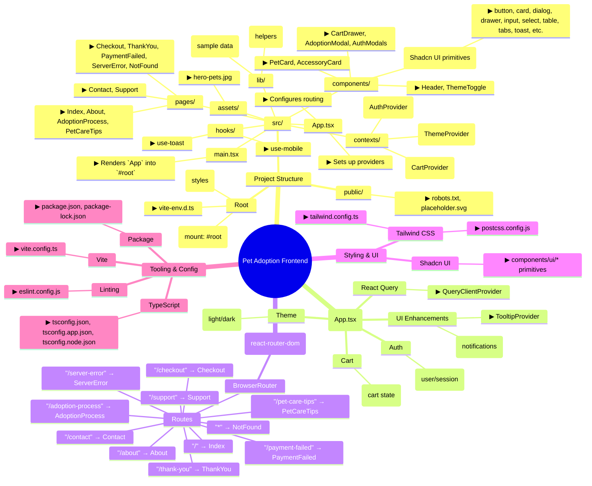

### Pet Adoption Frontend — Mind Map

Notes
- The UI primitives under `components/ui` are grouped for brevity.
- Providers wrap the entire app to enable theme, auth, cart, tooltips, and data fetching.
- Pages are registered as top-level routes in `App.tsx`.
