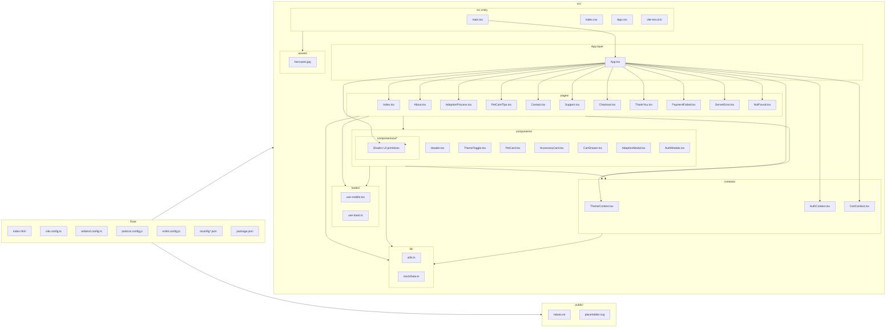

### Pet Adoption Frontend — Package Diagram

Notes
- Subgraphs represent logical packages/folders; arrows indicate primary dependencies.
- `components/ui/*` groups Shadcn UI primitives used across components and `App.tsx` for toasts/tooltips.
- Pages are routed by `App.tsx` and commonly depend on components, contexts, hooks, and lib helpers.
